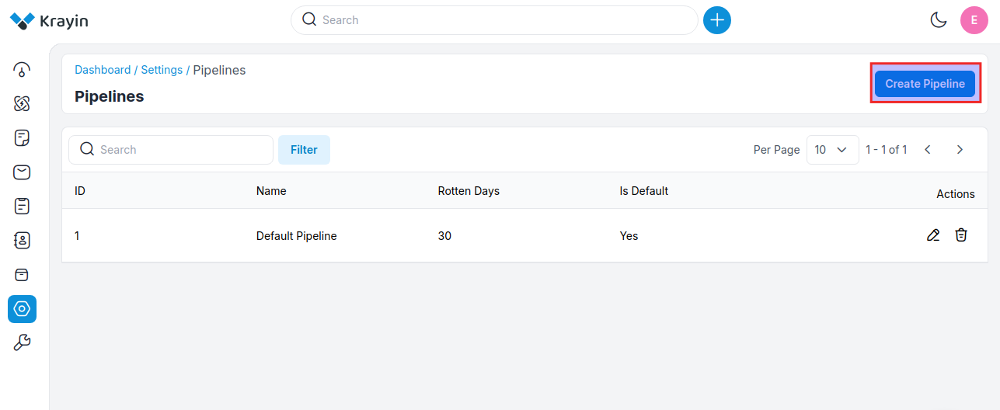
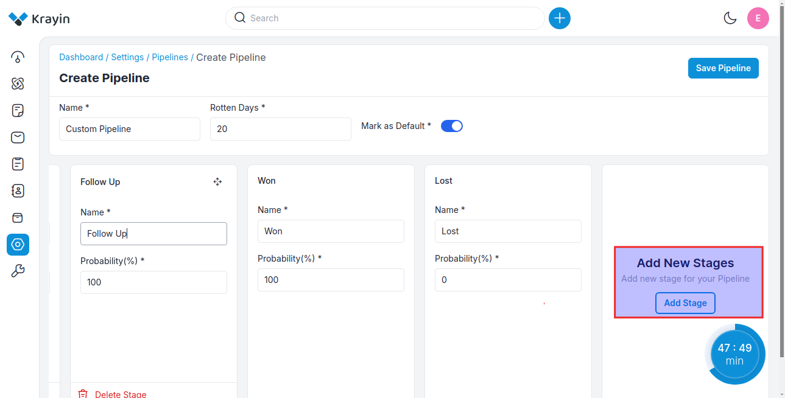
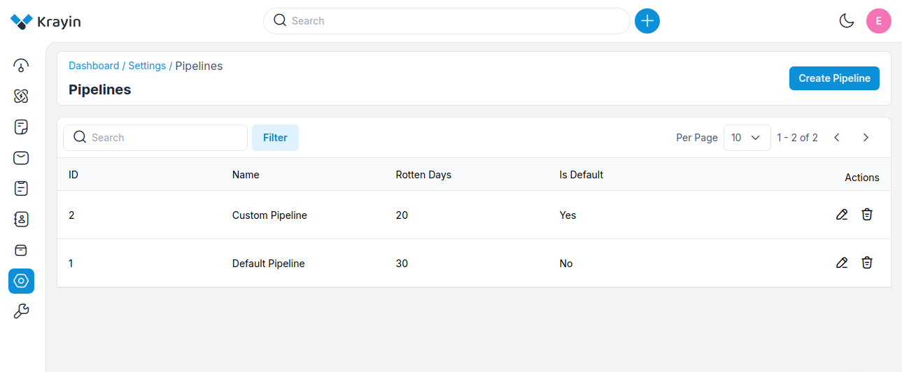

# Pipeline

A pipeline refers to the stages through which a potential customer progresses from initial contact to conversion. It's essentially a visual representation of the sales process, outlining the steps that sales representatives take to move prospects from being leads to becoming paying customers.

### Create a Pipeline in Krayin

**Step-1** Go to admin panel of krayin and click on **Settings >> Pipeline >> Create Pipeline** as shown in the below image.

**Step-2** Enter the below details.

**1) Name-** Enter the name of the pipeline.

**2) Rotting Days-** Enter the days till your pipeline gets finished.

**3) Mark as default-** Manage it from the enable/disable icon.

Now click on the **Save as Pipeline** button.

**NOTE-** Enter the name and the probability percent of the pipeline also you can add the stage by clicking on the **Add Stage** button.

**Step-3** A new record is created in the pipeline data grid as shown in the below image.

**NOTE-** You can also add new attributes to a pipeline and accordingly created attributes will visible on the lead. 

